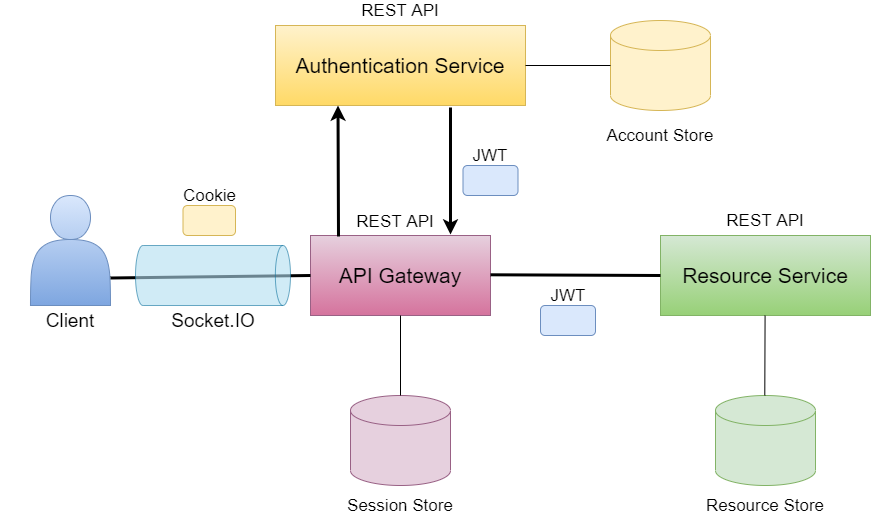

# API Gateway

The API gateway for the ChatBuds application is responsible for handling requests between the ChatBuds client and its services. It is also responsible for handling socket requests.

## System overview
ChatBuds is built as a small microservice-architecture. The consumer/client only communicates with the API Gateway which handles the back-end communication.

The client: https://gitlab.lnu.se/1dv613/student/ir222gn/projects/chatbuds

The Authentication Service: https://gitlab.lnu.se/1dv613/student/ir222gn/projects/auth-service

The Resource Service: https://gitlab.lnu.se/1dv613/student/ir222gn/projects/resource-service




## API documentation

### HTTP requests
The documentation of which http requests are possible to make is found at: https://app.swaggerhub.com/apis-docs/chatbuds/api-gateway/1.0.0

### Socket requests
API Gateway handles these custom socket events:

### `privateMessage`
Messages sent in private chats between friends.

Triggered: Manually

Example value for sending:
```
{
  data: {
    message: "Hej!"
  }
  to: "60912e4d912a5649b4c0a174"
}
```
Example recieved value:
```
{
  message: "Hej!",
  sender: {
    username: "Kalle"
    userID: "60928567e700db1fcce7394f"
  },
  to: "60912e4d912a5649b4c0a174"
}
```

### `publicMessage`
Messages sent in the public chat.

Triggered: Manually

Example value for sending:
```
{
  data: {
    message: "Hej!"
  }
}
```
Example recieved value:
```
{
  message: "Hej!",
  sender: {
    username: "Kalle"
    userID: "60928567e700db1fcce7394f"
  }
}
```

### `randomMessage`
Messages sent in finding a friend chat mode.

Triggered: Manually

Example value for sending:
```
{
  data: {
    message: "Hej!"
  }
  to: "60912e4d912a5649b4c0a174"
}
```
Example recieved value:
```
{
  message: "Hej!",
  sender: {
    username: "Kalle"
    userID: "60928567e700db1fcce7394f"
  }
}
```

### `validationError`
If a message is sent invalid a validationError message is emitted. The message property in private-, public- and randomChat must be a string, at least 1 character long and maximum 500 characters.

Triggered: Automatically

Example value for sending privateMessage event:
```
{
  data: {
    message: ""
  }
  to: "60912e4d912a5649b4c0a174"
}
```
Example recieved validationError event value:
```
{
  "The message must contain at least 1 character."
}
```

### `randomChatJoin`
To join the queue to finding a friend chat this event is emitted.

Triggered: Manually

Example value for sending:
```
{
  options: {
    previousChatBuddy: "60912e4d912a5649b4c0a174"
  }
}
```
Recieved value: Doesn't emit

It is optional to provide previousChatBuddy. If previousChatBuddy is provided the user won't get matched with that user while searching for a chatting friend.

### `chatMatch`
Triggered when another user is found when searching for a finding friend chat.

Triggered: Automatically

Example recieved value:
```
{
  userID: "60912e4d912a5649b4c0a174",
  username: "Molly"
}
```

### `randomChatLeave`
Triggered when a user leaves the finding friend chat partner.

Triggered: Manually.

Example value for sending:
```
{
  to: "60912e4d912a5649b4c0a174"
}
```
Recieved value: Emitted, but no content.

### `newFriend`
Triggered when two users becomes friends.

Triggered: Automatically when a friend request is accepted


Example recieved value:
```
{
  user: {
    username: "Molly",
    userID: "60912e4d912a5649b4c0a174"
  }
}
```

### `friendRequest`
Emitted to the reciever when a friend request is sucessfully sent.

Triggered: Automatically

Example recieved value:
```
{
  from: {
    username: "Kalle"
    userID: "60928567e700db1fcce7394f"
  }
}
```

### `removeFriend`
Triggered when one user removes another user as a friend, both gets this event.

Triggered: Automatically

Example recieved value:
```
{
  user: {
    username: "Molly",
    userID: "60912e4d912a5649b4c0a174"
  }
}
```

## Starting up this project locally
To run the API Gateway locally you will need to add a .env file to the root of the project.

The .env file should contain:

- PORT= which port the API Gateway should run on
- SESSION_NAME= the session (cookie) name
- SESSION_SECRET= the session secret
- SESSION_AGE= how long a session (cookie) lasts
- AUTH_SERVICE_URL= root URL to the auth service
- RESOURCE_SERVICE_URL= root URL to the resource service
- DB_CONNECTION_STRING= the database connection string

(replace the description next to "=" with its desired value)

### Enter "npm install" in the terminal to build the dependecies

## Running API Gateway
Development mode: enter "npm run start:dev" in the terminal.

Production mode: enter "npm start" in the terminal.

## Linting the code
Check for linting problems by entering "npm run lint" in the terminal.

Fix linting problems automatically by entering "npm run lint:fix" in the terminal.
